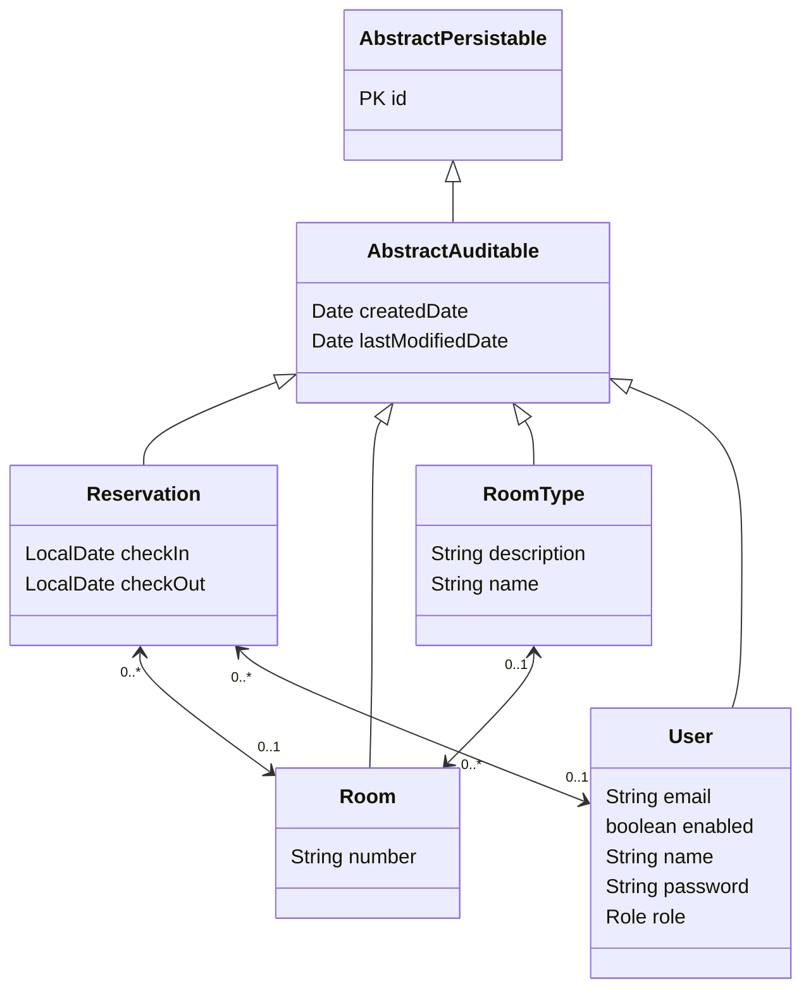

# Small Hotel Reservation System
## Story

Develop a small hotel reservation system. The application will use two types of users – hotel employees and customers.

Hotel administrators should be able to:

- Manage rooms – view / add / remove / edit
- See the schedule for each room
- See hotel availability statistics (how many rooms are free/busy) for a specified period

Customers should be able to:

- Check availability on the specified period
- Make a reservation

## Model UML diagram

## Acceptance tests

For functional testing, I used the [HTTP client](https://www.jetbrains.com/help/idea/http-client-in-product-code-editor.html) built into the IntelliJ development environment. These tests can also be run from the command line and included in the CI process. The utility for running tests from the command line is located here.

https://github.com/restcli/restcli
