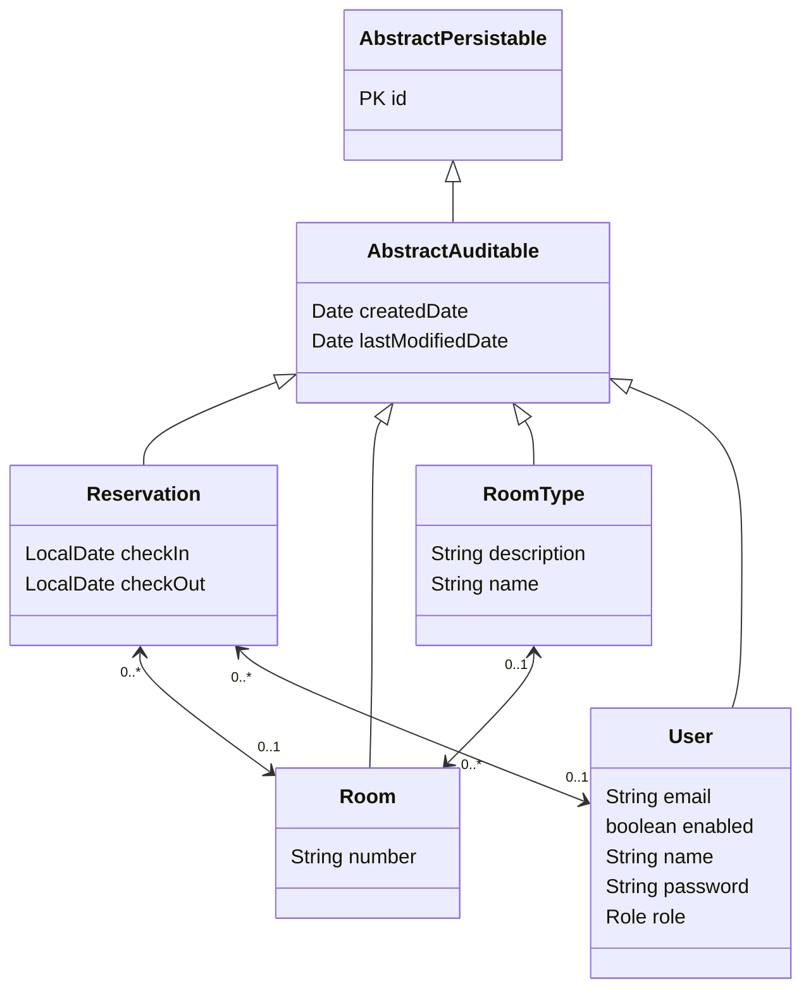

# Small Hotel Reservation System

## Model UML diagram

```mermaid
classDiagram
    direction BT
    class AbstractAuditable {
        Date  createdDate
        Date  lastModifiedDate
    }
    class AbstractPersistable {
        PK  id
    }
    class Reservation {
        LocalDate  checkIn
        LocalDate  checkOut
    }
    class Room {
        String  number
    }
    class RoomType {
        String  description
        String  name
    }
    class User {
        String  email
        boolean  enabled
        String  name
        String  password
        Role  role
    }
    
    AbstractAuditable  --|>  AbstractPersistable 
    Reservation  --|>  AbstractAuditable 
    Room  --|>  AbstractAuditable 
    Room "0..1" <--> "0..*" Reservation 
    Room "0..*" <--> "0..1" RoomType 
    RoomType  --|>  AbstractAuditable 
    User  --|>  AbstractAuditable 
    User "0..1" <--> "0..*" Reservation 

```